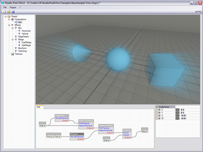
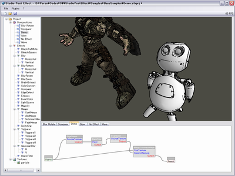
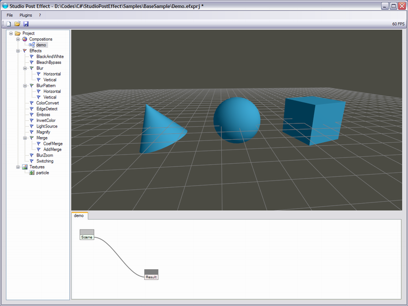
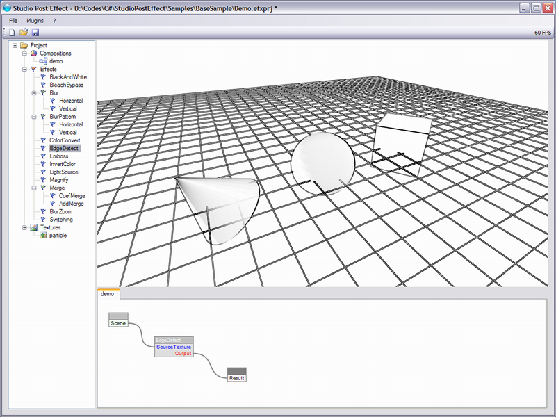
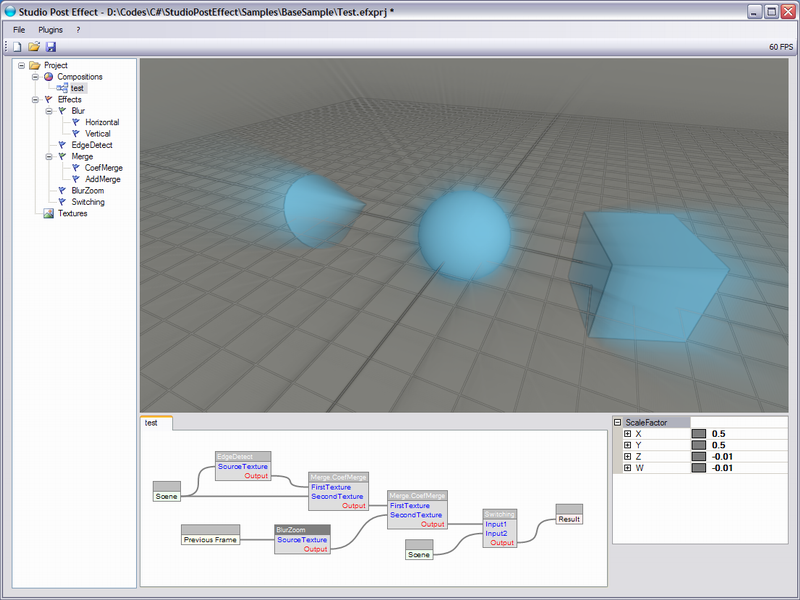
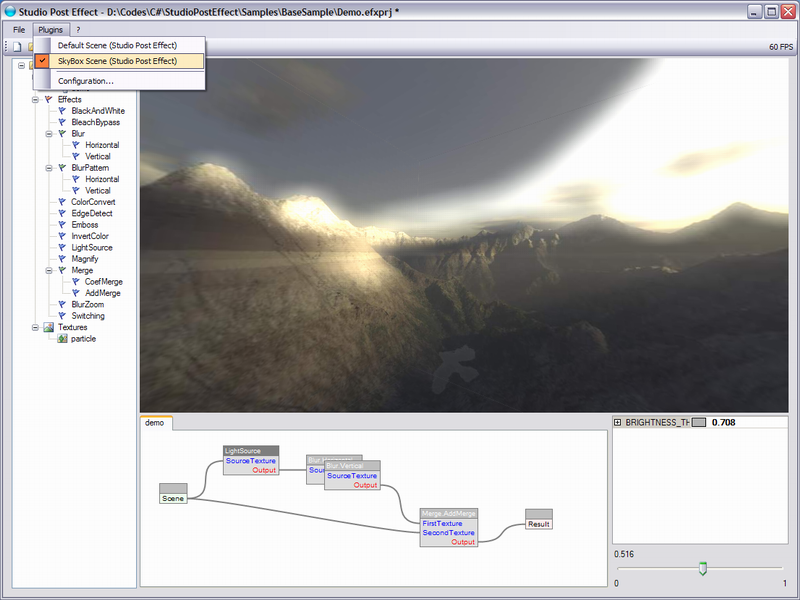
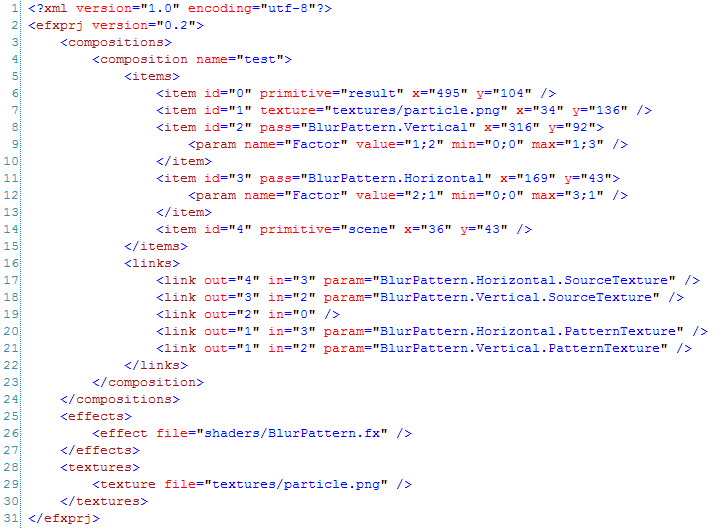
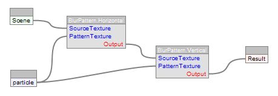

# Studio Post-Effect

## Overview

Studio Post-Effect is a development tool for post effects (post process) creation. It is mainly designed for programmers and designers to quickly develop, debug and check pixel shaders and higher level effect compositions in real time.

It has been developped with Windows Forms and Managed DirectX APIs, so it is a Windows only application.

*Videos* 

*Screenshots* 
&nbsp;&nbsp;&nbsp;&nbsp;

## Disclaimer

First and foremost, you have to know that this application is not maintained anymore, the source code is provided for educational purpose only.

However, this code base is quite old now, I wrote it in 2009, and it is based on Managed DirectX, which has been deprecated many years ago.
I am not planning to rewrite it nor update it with recent technologies. 
Also, since this code is old, it might not be as clean and efficient as I would have wished.

## Downloads

Here is the download section. 
Note that to run the application, you will need to have the Microsoft .NET Framework 2.0 and DirectX 9 installed on your computer.

### Application

Link                                     | Version       | Date             | Comment
-----------------------------------------|---------------|------------------|---------------------------------------------------------
[Studio Post-Effect 1.0.300][Download17] | 1.0.300 (x64) | October 31, 2009 | Executable only, for testing on 64bit OS.
[Studio Post-Effect 1.0.300][Download16] | 1.0.300       | June 15, 2009    | Fix parameter control bug.
[Studio Post-Effect 1.0.297][Download15] | 1.0.297       | June 11, 2009    | Fix important workflow editor bugs.
[Studio Post-Effect 1.0.289][Download14] | 1.0.289       | June 9, 2009     | Fix many bugs.
[Studio Post-Effect 1.0.269][Download13] | 1.0.269       | June 6, 2009     | Now works on Vista. Several improvements. New plugin.
[Studio Post-Effect 1.0.204][Download12] | 1.0.204       | May 31, 2009     | Fix several bugs, new shaders.
[Studio Post-Effect 1.0.152][Download11] | 1.0.152       | May 12, 2009     | Fix multisampling bug for old computers.

### Shaders

Link                                     | Version | Date         | Comment
-----------------------------------------|---------|--------------|----------------------------------
[WPF Effect Library Shaders][Download23] | -       | June 6, 2009 | Effect Library from CodePlex.
[Pixels Shaders][Download22]             | 0.3     | May 31, 2009 | Added Ogre and WPF pixel shaders.
[Basic Pixel Shaders][Download21]        | 0.2     | May 6, 2009  | First release.

### Others

Link                                   | Version | Date         | Comment
---------------------------------------|---------|--------------|-------------------------
[Scene Plugins Data][Download33]       | 1.0.289 | June 9, 2009 | All data of the scene plugins (now separated from application for space purpose).
[Scene Plugins source][Download32]     | 1.0.269 | June 6, 2009 | Source code of all default plugins.
[VideoRenderPlugin source][Download31] | 1.0     | May 31, 2009 | C# source code of the VideoRender scene plugin.

## Links

Videos: https://www.youtube.com/playlist?list=PLUGTdE60IANi5sL7FQYgQRWHw6aLUNcUr

Original project web site: https://sites.google.com/site/studioposteffect 
Original source code web site: http://spe.codeplex.com/ 

## Screenshots

Here are some screenshots of Studio Post-Effect application.

 
The default view after loadin a project (sample). The left pane shows the project content such as compositions and usable effects and textures. 
The bottom pane shows the workflow of the current composition. 
Here the secne is directly connected to the display (scene -> result) without any effect in the middle.
 
 

 
On this shot, an edge detection post-effect is applied to the scene and connected to the display.
 
 

 
This shot shows a complex workflow with several effects to construct a higher level effect (composition). 
In this composition the scene is merged with an edge-detection applied to that same scene render, with a zooming effect applied to the previous rendered frame. 
Finally the output is plugged to a switch effect to make the designer able to easily switch effect on and off.
 
 

 
This shot shows a glow (bloom) effect applied to a skybox render. 
The skybox is displayed through a plugin. 
The previous shots showed a simple scene with cone, sphere and cube, these are also rendered through the default scene plugin. 
Anyone is free to write its own plugin to display any kind of data.

## Documentation

Unfortunately, the documentation has never been really written. 
Hereafter is a quick doc about important things that one may be interested in.

### Create a render plugin

For the ones confortable with .NET languages, you can try creating a new class library project, adding reference to IScenePlugin.dll, which is in the root folder of Studio Post-Effect application and create a class which implement the IScene interface. 
Then copy your dll to the plugins folder and restart Studio Post-Effect.

### Exploiting data of the project file

Hereafter is the description of Studio Post-Effect project file format. 
The project file (.efxprj) is just a simple xml file, and thus anybody can exploit its data, for example creating a converter that generates Ogre Engine compositor files from Studio Post-Effect composition workflows.

In this project file, you can see the "effects" markup, as well as the "textures" markup. These xml containers respectively contain the effects (pixel shaders) and the textures (image such as png, jpeg, etc...). The "file" attribute contains the location of the file relative to the current project xml file.

The most important and interesting part is the "compositions" markup. This element contains all the workflows information. The child items are "composition" containers which are named from Studio Post-Effect application.

Each of these containers stores "items", which are workflow items such as pixel shaders, textures, inputs, output, etc... and "links", which are the links that connect the workflow elements and thus describes the way the composition behaves.
The "items" element stores only "item" child element, and "links" elements stores only "link" elements.

"item" element :

- "id" : This is unique identifier among the current composition, it is used in the "links" to reference the proper linked item,
- "x" : The location of the effect item on the workflow UI, along the x axis (not interesting for exporters/converters),
- "y" : The location of the effect item on the workflow UI, along the y axis (not interesting for exporters/converters),
- "texture" : If present, tells the item is a texture. It is identified by it's location path (unnamed element),
- "pass" : If present, tells the item is an effect. it is identified using the technique name and the pass name, concatenated using a dot character. With this type of item, there may be child elements named "param" which describes the shader parameters involved in this pass (described later). Note that there are pass items with no parameters.
- "primitive" : If present, tells the item is a primitive elements of the application, such as inputs and output. The existing elements are :
  - "scene" : Represents the standard scene render,
  - "prevframe" : Represents the previous frame (useful for some effects such as motion blur),
  - "result" : Represents the final render.

(an "item" element can have only one "texture", "pass" or "primitive" attribute.)

About the "param" elements (child elements of "item" elements representing a pass) :
- "name" : This is the name of the parameter as coded in the related pixel shader,
- "value" : This is the value, and there might be several values. Values are separated by a semicolon (';'). The value do not provide information about the parameter type,
- "min" : This represents the minimum values bound for Studio Post-Effect parameter box. (not interesting for exporters/converters),
- "max" : This represents the maximum values bound for Studio Post-Effect parameter box. (not interesting for exporters/converters).

"link" element :

- "out" : This is the identifier of the "item" used as first element of the link (the link is plugged to the 'output' of that "item"),
- "in" : This is the identifier of the "item" used as second element of the link (the remaining link bound is plugged to the 'input' of that "item"),
- "param" : If present, describes the full name of the input parameter in which the link is plugged.

So in the exemple above, let's describe the workflow textually to ensure the correspondance, in the same order as "link" elements appear :

"The scene is plugged to the first parameter (Horizontal.SourceTexture) of the horizontal blur effect",
"The horizontal blur effect is plugged to the first parameter (Vertical.SourceTexture) of the vertical blur effect",
"The vertical blur effect is plugged to the output (final render)",
"The pattern texture is plugged to the second parameter (Horizontal.PatternTexture) of the horizontal blur effect",
"The pattern texture is plugged to the second parameter (Vertical.PatternTexture) of the vertical blur effect",

As this description shows, the order of the "link" elements as no relationship with the workflow running sequence order.

[Download11]: download/StudioPostEffect_1.0.152.zip
[Download12]: download/StudioPostEffect_1.0.204.zip
[Download13]: download/StudioPostEffect_1.0.269.zip
[Download14]: download/StudioPostEffect_1.0.289.zip
[Download15]: download/StudioPostEffect_1.0.297.zip
[Download16]: download/StudioPostEffect_1.0.300.zip
[Download17]: download/StudioPostEffect_1.0.300(x64).zip

[Download21]: download/shaders_0.2.zip
[Download22]: download/shaders_0.3.zip
[Download23]: download/WPF_Effect_Library_Shaders.zip

[Download33]: download/ScenePluginsData_1.0.289.zip
[Download32]: download/ScenePlugins_source_1.0.269.zip
[Download31]: download/VideoScenePlugin_source.zip
